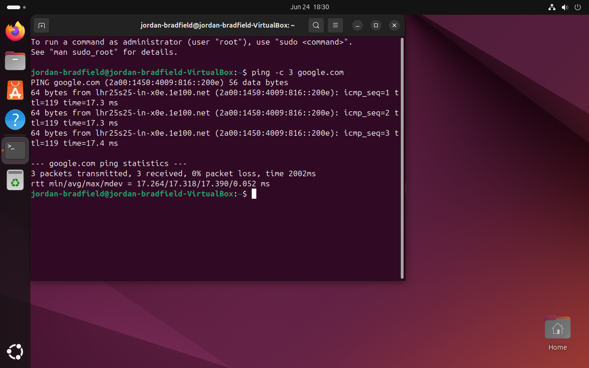
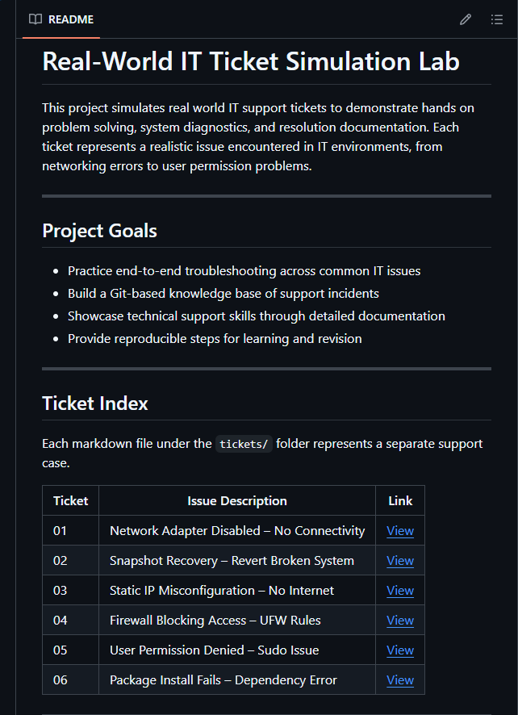
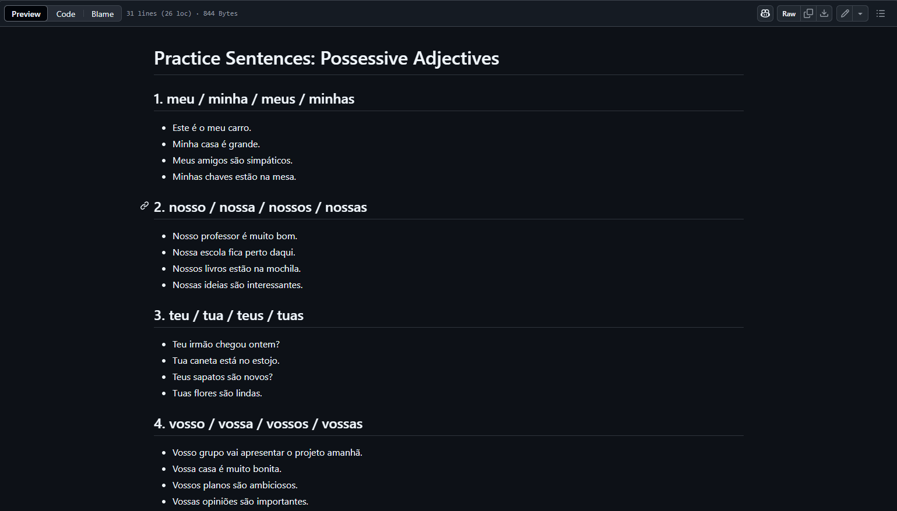

# Jordan Bradfield – IT Support & Systems Portfolio

Welcome to my technical portfolio. This repository serves as a central summary of my hands on projects in IT support, virtualization, system troubleshooting, and technical documentation.

---

## Key Projects

### VirtualBox Troubleshooting Lab
**Description:** Full VM deployment and error simulation using VirtualBox and Ubuntu 22.04. Includes snapshot handling, network errors, terminal diagnostics, and system documentation.

Repository: [virtualbox-troubleshooting-project](https://github.com/jordgarvi/virtualbox-troubleshooting-project)

**Skills Demonstrated:** Virtualization, Troubleshooting, Documentation, Git, Ubuntu

---

### Real-World IT Ticket Simulation Lab
**Description:** A practical lab simulating common IT issues such as network failure, static IP conflicts, firewall blocking, user access problems, and package installation errors. Each ticket includes diagnostics, commands used, and solutions.

Repository: [real-world-it-ticket-simulation-lab](https://github.com/jordgarvi/real-world-it-ticket-simulation-lab)

**Skills Demonstrated:** Linux, Problem Solving, IT Support Simulation, Recovery Techniques

---

### Portuguese Flashcard Study Deck
**Description:** While learning European Portuguese, I created this flashcard deck in Markdown to help myself stay consistent with vocabulary and verb conjugation. It’s structured for Anki and version controlled in GitHub so I could track progress and stay organised.

Repository: [portuguese-flashcards](https://github.com/jordgarvi/portuguese-flashcards)

**Skills Demonstrated:** Markdown, Language Learning Resources, GitHub Pages (optional)

---

## Upcoming Projects

- Windows 10/11 Troubleshooting Logs
- Dual Boot & OS Recovery Workflow
- Basic Cloud Foundation Lab (Azure or AWS)
- IT Automation Scripts with Bash and PowerShell

---

## About This Portfolio

This repository is my way of sharing the hands on technical work I have been doing on my own initiative. It’s aimed at recruiters, hiring managers, and fellow tech enthusiasts who want to see real world skills in action, not just theory. Through these projects, I’m showing how I learn, troubleshoot, document and deliver practical IT solutions with clarity and care.
